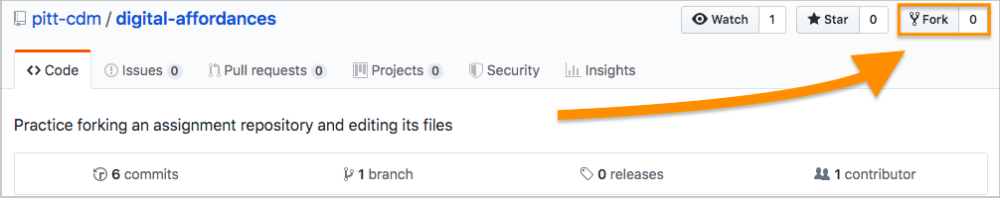
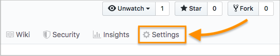
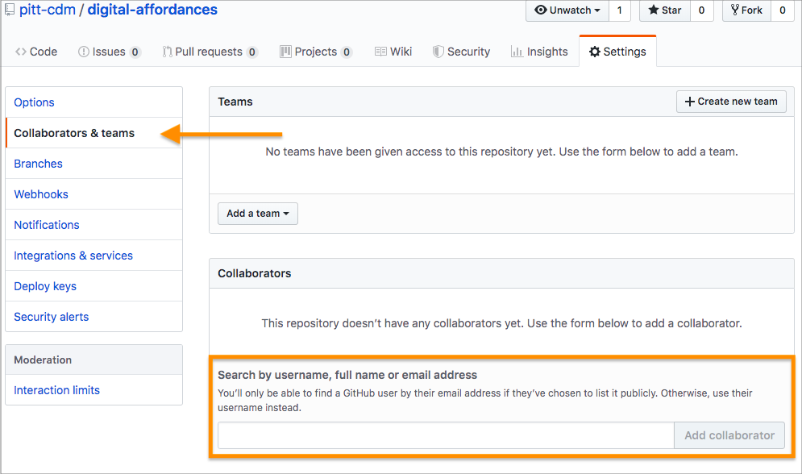

# Practice forking an assignment repository and editing its files

## A few terms of art
A **repository**, often abbreviated to **repo**, is just a fancy way of saying _folder_. It's a bunch of files. It can have subfolders inside it. You're looking at a repository right now! (See the files up above this text?)

This text is, itself, coming from a single file inside the repository, with the special name of **README.md**. Anything appearing in the README will show up here. The file extension, '.md', refers to [Markdown](https://www.markdownguide.org/basic-syntax/), a simple syntax for signaling display formats (bold, italic, headings, etc) in plain text files. As you can see here, GitHub knows how to render markup like `**repo**` in bold. Follow that link for an overview of markdown syntax you can use.

To **fork** a repo is to _make a copy_ of it: all the files, and – interestingly – the complete \*history\* of those files. This lets you safely play with and edit the files, without worrying that you'll overwrite someone else's work. For today, I've asked you to work in teams; for the major projects coming up, you'll each have an individual set of files.

## Your task: use the "five principles" as a lens
For this particular assignment, I'm asking you to work in groups to apply the ideas from [Tyler Su's "Playing Lev Manovich"](https://tylertsu.com/o/). What do the "five principles of new media" help you see?

### I. Make a copy you can edit
1. To start, the team anchor should **Fork this repository,** using the button at the top right. 
2. Once you have your own copy, go into your Settings...  
3. ... and **add your groupmates as collaborators**. (You'll need to ask for their usernames or email addresses.)
4. Everyone else will need to check their email and accept the invitation.

### II. Do the work
1. **Create a new file**, named for one of the five principles in Su: (1) numerical-representation.md, (2) modularity.md, (3) automation.md, (4) variability.md, or (5) transcoding.md
   - Five groups, so each group will start with a different file: use your breakout room number with the list above.
   - Note that filenaming convention: all lowercase, no spaces.
   - The .md file extension lets you use ["markdown" syntax](https://guides.github.com/features/mastering-markdown/), like using asterisks to mark list items.
   - **As your first commit, put in about ten blank lines.** This should allow each member of the group to later edit simultaneously, without conflicting with each other when you merge.
   - Use a meaningful commit message, i.e. don't accept the default "create new file": instead, say *what* is new in this version, e.g. "add starter file with 10 blank lines".
2. In that file, you're going to **make a list** of examples of where you've seen that principle in action.
   - What does this principle help you notice about how or why Su constructed her piece the way she did?
   - What does this principle help you notice, or wonder, about your favorite website or app?
   - What other examples from your digital day-to-day come to mind as you think about this principle?
3. **Take turns** adding to the file, saving and committing as you go, so that **everyone in the group gets to make at least one commit.**
   - Each time, use meaningful commit messages: rather than accept the default message, like "update modularity.md" (which tells us nothing about _how_ you've updated it), write something like "add example from nytimes.com."
   - If you're patient enough to go one at a time, you can commit straight to the main branch without deleting each other's contributions. But to edit at the same time and _merge_ the edits, practice using _pull requests_ instead. This ensures you're always adding to the most recent version, even if it's changed since you started your edit.
   - Pull requests take more clicks, but they're worth it when working with collaborators! 
4. Did you know that when you fork, you can also file a pull request back to the original repository?
   - From either the home screen of the repo or the "Pull Requests" tab, click on the "New pull request" button...  !<!-- [upstream pull request 2](github-upstream-pull-request-2.png) -->
   - Verify that the arrow is pointing from your repo (the "head") back to the original (the "base")... 
   - and click to start the merge and review process, as above!

EXT: All done with the main activity? Read the file in this repo (folder) called `murray--four-affordances.md`, and follow the prompts inside it.

EXT: Consider further: Manovich was talking about "new media," but Murray was talking about "digital media." Is there a difference? If time allows, **make some notes in the murray--four-affordances file.**

EXT: If you finish working on all that and are still waiting for other groups, go back to step II.1 and move on to the next "principle." Start by "pulling" the latest version from the upstream branch and then use pull requests, so you can merge with the other group's file.
